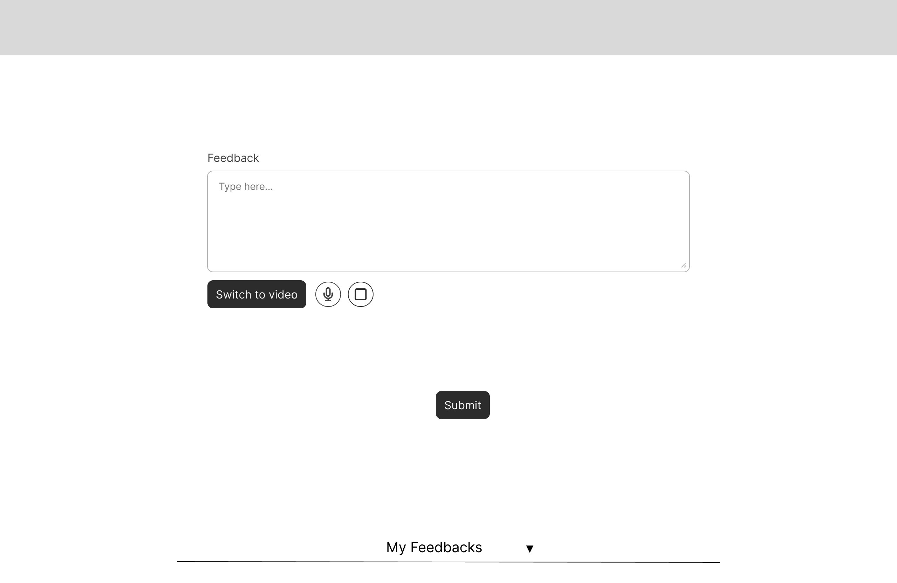
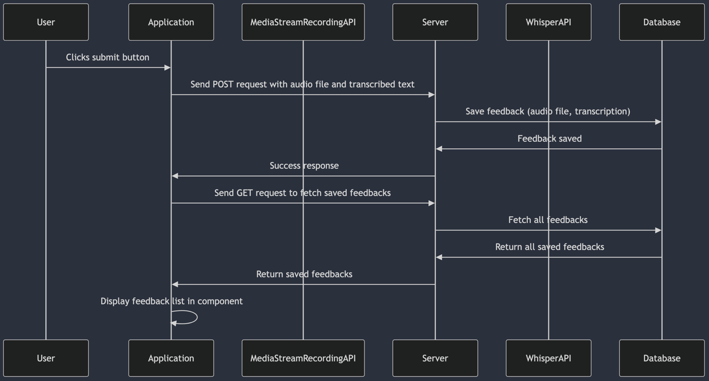

# Functional Design
## Project Client on Board
**Team Members:**  
Danylo Kurbatov, Julie Kuttschreutter, Maksim Sadkov, Mihaela Stoyanova, Simona Waxmann, Syandana Suntana  
**Team Name:** DHI2V.So - Team 3V

---

## Table of Contents
1. [Introduction](#1-introduction)
    - [Problem](#problem)
    - [Problem Analysis](#problem-analysis)
    - [Goals](#goals)
    - [Possible Solutions](#possible-solutions)
    - [Context Research](#context-research)
2. [Solution Overview](#2-solution-overview)
    - [Solution Vision](#solution-vision)
    - [Scope](#scope)
    - [Requirements (Non-Functional)](#requirements-non-functional)
    - [Risks and Assumptions](#risks-and-assumptions)
3. [Functional Specs](#3-functional-specs)
    - [Business Logic: Roles, Rules, and Data Involved](#business-logic-roles-rules-and-data-involved)
    - [Epics and User Stories](#epics-and-user-stories-unrefined)
    - [Mockups and Wireframes (Low-Fidelity)](#mockups-and-wireframes-low-fidelity)
4. [System Architecture](#4-system-architecture)
    - [Basic Architecture with Logical Components](#basic-architecture-with-logical-components)
    - [Deploy and Component Diagram](#deploy-and-component-diagram)
5. [Change Log](#5-change-log)

---

## 1. Introduction

### Problem

Scorion is a software company which develops the software product: Scorion. This software product is a digital education platform used by medical schools for workplace learning. With Scorion, the teachers can give feedback in the form of text, whether it is typed manually or transcribed via a third-party application, on the assignments and assessments that the medical students performed. This feedback is then displayed on a dashboard, which tracks the progress and development of the student.

Many users of the program have requested an audio feedback feature to be added to the Scorion environment, since receiving spoken feedback is important for the learning process of a student.

Our main job for this project is to design and develop a way, within the Scorion environment, to easily record audio feedback in a form, and make sure that the audio fragment is saved along with the text. And that the process of transcribing these audio files happen within the Scorion environment as well.

### Problem Analysis
Currently, feedback is only collected as text (either manually typed or transcribed by a device). The application lacks the functionality to record audio feedback.  
The main users of the application are students and teachers. The teachers can give feedback on a (practical) assignment of a student. The teacher and student both should be able to access the feedback.

### Goals
For fixing the problem, we have established the following goals:
- The teachers should be able to record audio feedback directly in the Scorion environment.
- The audio feedback files should be able to be stored alongside the feedback forms.
- The students should be able to access their feedback within the Scorion environment.
- The manner of recording the audio feedback should be compatible with most browsers / devices.

### Possible Solutions
- Usage of MediaStream Recording API to record and save audio feedback.

### Context Research
The users of the application that we are going to be working on are students and teachers in medical education. The Scorion platform is used by students to submit their assignments / assessments and request feedback for this from the teacher. Currently, teachers are providing feedback to their students by filling in a form (text) or transcribing an audio recording to text using third-party applications.

One of the  problems that the teachers are facing, is that they also want a possibility to record audio feedback, in a way that the students don’t receive the feedback in text form, but also the audio file itself. The audio files should be saved alongside the transcripts.

Then the second problem, at the moment the users giving feedback in the form of transcribing audio to text rely on third-party applications, but it would be preferred to generate transcripts of the recorded audio directly within the Scorion environment, so no third-party applications are involved anymore. This also allows the platform to maintain better data security and compliance with educational and privacy regulations, since audio data doesn’t pass through other applications anymore.

The users receiving the feedback would benefit more from audible feedback than the text feedback that they receive now. Since listening to spoken feedback is better to retain information than when they have to read the feedback.

We will develop a built-in audio recording functionality, which can also easily play-back these audio recordings. We will also implement a transcribing functionality that will transcribe the recorded audios to text within the Scorion environment. These audio files and transcriptions will be safely stored in the Scorion system.

---

## 2. Solution Overview

### Solution Vision
The vision is to enhance the existing platform by enabling users to record voice feedback, transcribe it into text, and save it. This will simplify the feedback process, improve accessibility, and offer additional functionality for users who prefer audio feedback over typing.

### Scope
**The project includes:**

- Frontend Integration: Adding a UI component for audio recording, text input and audio file.
- Backend Processing: Storing the audio file and using a transcription service to convert audio to text.
- Output Management: Displaying the transcribed text for user verification and saving both text and audio feedback.
- Optional: Explore video feedback integration if feasible within the timeline.

### Requirements (Non-Functional)
| Type         | Requirement                                                                                                                   | Priority | Source  |  
|--------------|-------------------------------------------------------------------------------------------------------------------------------|----------|---------|  
| Availability | As a user I want to be able to provide a feedback without dependence on my device OS.                                       | Must     | Client  |  
| Performance  | As a user I want the transcription to go smoothly without service being frozen.                                               | Should   | Client  |  
| Robustness   | As a user I want a reliability of the service when the transcription is going, so no data will be lost.                       | Must     | Client  |  
| Security     | As a user I want my data to be secured so third party APIs won’t  access it.                                                  | Should   | Client  |  
| UX           | As a user I want service to be smooth and designed appropriately to the design standards of the already existing style guide. | Should   | Client  |  
| Usability    | As a user I want service to be intuitively understandable with all the functionality displayed.                               | Should   | Client  |   |          |         |

### Risks and Assumptions

#### Risks
- **Integration Challenges:** Difficulty integrating third-party APIs for transcription may delay implementation.
- **Latency Issues:** Delays in processing and transcription may lead to not the best users' experience.
- **Feature Scope Creep:** Additional requirements (e.g., video feedback) could lead to overruns in time.

#### Assumptions
- Adequate API support is available and reliable.
- Needed API is free.
- Users have access to the service with microphones and a stable internet connection.
- The quality of the sound is more-likely good.

---

## 3. Functional Specs

### Business Logic: Roles, Rules, and Data Involved

### Epics and User Stories (Unrefined)
| **Feature** | **User Story** | **Priority** | **Source** |
|-------------|----------------|--------------|------------|
| **U1**      | As a user, I want to be able to record feedback in the form of audio, in order to improve the effectiveness of communication by capturing intonation and the tone of the feedback. | Must         | Assignment Description & Client |
| **U2**      | As a user, I want my audio feedback to be saved, so that it can be accessed later. | Must         | Assignment Description & Client |
| **U3**      | As a user, I want the text transcription to be saved along with the recording, so that both can be referenced together. | Must         | Assignment Description & Client |
| **U4**      | As a user, I want reliable speech-to-text functionality to automatically transcribe my audio feedback into text, so that I don't have to type out my feedback manually. | Must         | Assignment Description & Client |
| **U5**      | As a user, I want to be able to pause and resume the recording, so that I can make sure that the audio recording is not bothered by external sources. | Must         | Assignment Description & Client |
| **U6**      | As a user, I want the audio recording and text feedback to be protected and kept within the system, because the data I send is confidential. | Must         | Assignment Description & Client |
| **U7**      | (Story not provided) | Must         | Client |
| **U8**      | As a user, I want the speech-to-text input to be multilingual so that it can support multiple languages and increase the accessibility. | Should       | Client |
| **U9**      | As a user, I want to be able to record a video file to provide feedback, so that I can show my expressions better. | Should       | Client |
| **U10**     | As a project team member, I want to provide well-researched advice on implementing video feedback, so that the client can evaluate its feasibility for future development. | Could        | Assignment Description |

---

### Mockups and Wireframes (Low-Fidelity)

#### 1. Starting screen

#### 2. Switched to video recording and the feedback list

#### 3. Recording audio file

#### 4. Completed audio file

#### 5. Audio file is transcribed

#### 6. Completed video file

### Basic Use Case Diagram

The user has three options for submitting feedback. Recording audio, video or just typing out their feedback. 
After they record an audio or video, they can transcribe the recording, which will be shown to the user. 
Afterward, they can submit it which will be sent to the backend/database, along with the transcription. The user then can view the feedback they submitted, 
which will be pulled from the backend/database to be shown to the user.

----

### Sequence Diagrams

#### 1. Recording feedback

This sequence diagram shows how the action of the user recording either their audio or video works. It also shows that the user can pause the recording and resume it later.

The wireframes that represent this diagram are the following:

- 1 Beginning screen
- 3 Recording audio file
- 4 Completed audio file
- 6 Completed video file

#### 2. Transcribing recording file

This sequence diagram shows how the action of the user clicking the transcribe button to transcribe a recording file works.

The wireframes that represent this diagram are the following:

- 4 Completed audio file (start)
- 5 Audio file is transcribed

The application can transcribe both audio and video files.

#### 3. Submitting feedback

This sequence diagram shows how the action of the user clicking the submit button works.

The wireframes that represent this diagram are the following:

- 5 Audio file is transcribed
- 6 Completed video file
- 2 Switched to video recording and the feedback list (feedback shows up in the feedback list)

#### Complete sequence diagram

This sequence diagram shows all the sequence diagrams together, representing how a user could fill in the feedback form and submit it.

---

## 4. System Architecture

### Deploy and Component Diagram

In this diagram, there are 4 nodes with each a component within them.

- **User device:** The user device is the machine on which the user uses the application. They can access the application with their *web browser*.
- **Front-end server:** The front-end of the application is hosted on a *Vite web server* and the front-end is written in *Svelte and JavaScript*.
- **Back-end server:** The back-end of the application is hosted on an *ExpressJS server* and is written in JavaScript, which *ExpressJS* already implies.
- **Database server:** The database the application is using is an *SQLite database*.

For the components within the diagram, they are connected in the following ways:

- The web browser and Vite web server are connected by *HTTP*.
- The Vite web server and ExpressJS server are connected by *HTTP and REST*.
- The ExpressJS server and the SQLite database are connected by *SQL*.

---

## 5. Change Log

---

