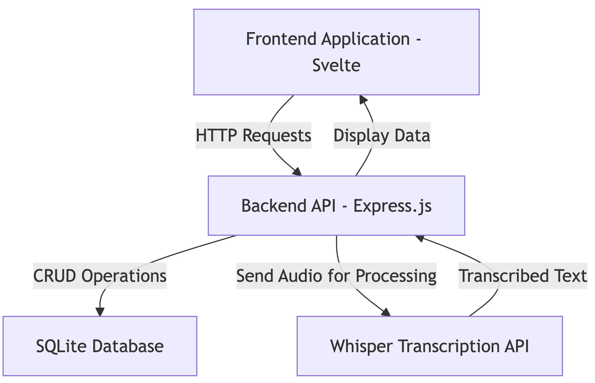
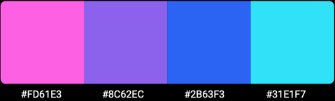
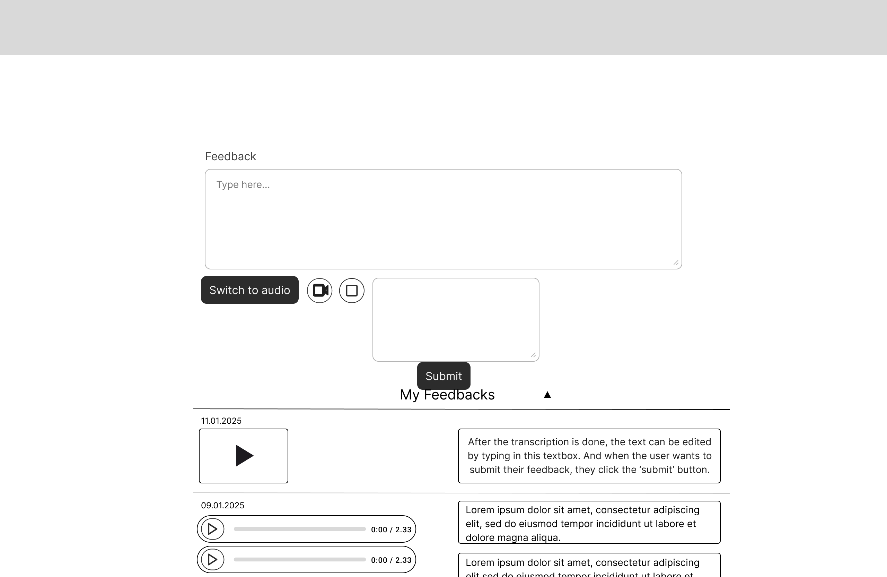
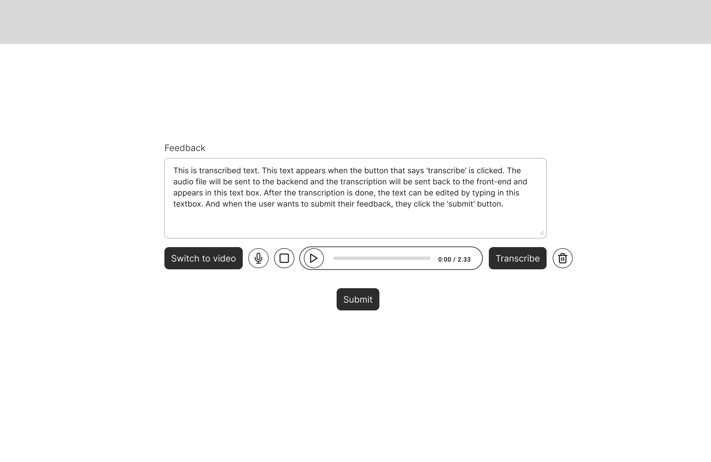
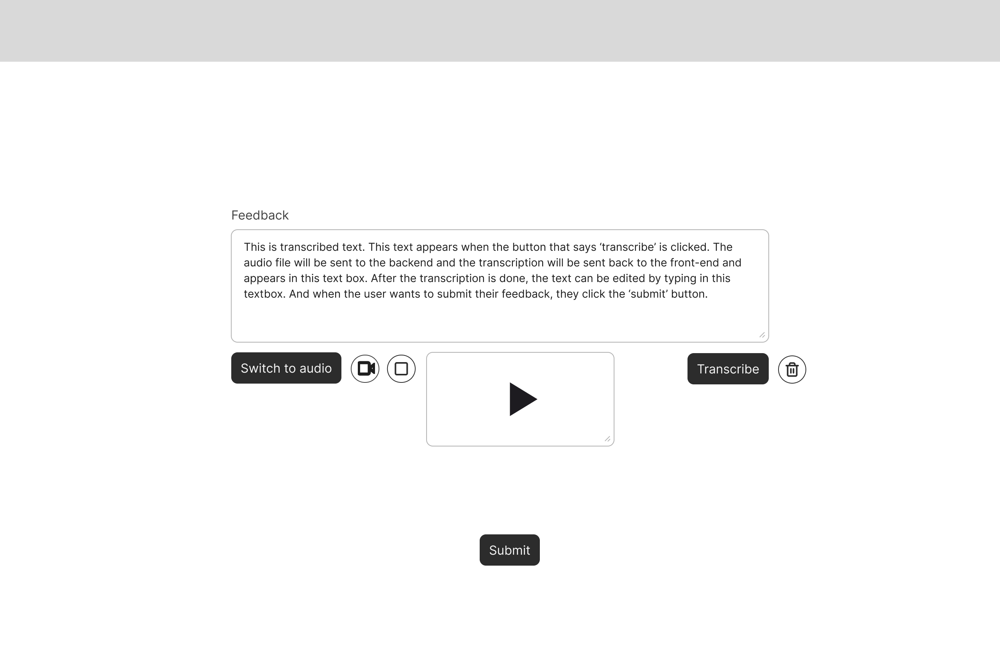

# System Design

**DHI2V.So – Team 3V**  
Danylo Kurbatov, Julie Kuttschreutter, Maksim Sadkov, Mihaela Stoyanova, Simona Waxmann, Syandana Suntana

---

## Table of Contents

1. [Introduction](#introduction)
2. [General Overview and Design Approach](#general-overview-and-design-approach)
    - [Main Components](#main-components)
    - [Alignment with International Security Standards](#alignment-with-international-security-standards)
3. [Design Considerations](#design-considerations)
    - [Goals and Guidelines](#goals-and-guidelines)
    - [Development Methods and Contingencies](#development-methods-and-contingencies)
4. [System Architecture](#system-architecture)
    - [Logical View](#logical-view)
    - [Hardware Architecture](#hardware-architecture)
    - [Software Architecture](#software-architecture)
    - [Information Architecture](#information-architecture)
    - [Security Architecture](#security-architecture)
    - [Performance](#performance)
5. [System Design](#system-design)
    - [Database Design](#database-design)
    - [User Interface Design](#user-interface-design)
    - [Hardware Design](#hardware-design)
    - [Software Design](#software-design)
    - [Security Design](#security-design)
6. [Changelog](#changelog)

---

## Introduction

Scorion is a software company that provides the eponymous platform to medical schools in several countries. As a part of an improvement of the current feedback system between teachers and students who use their platform, the company decided to improve their feedback system.

Currently, the company has a functionality for giving feedback via text and audio files. However, the audio recording is transcribed into text using third-party applications. Since the client is developing a product for medical schools, all research-related data must be confidential and must be protected. For this purpose, the client asked to develop a system which will retain the functionality for recording text and audio feedback. More importantly, audio feedback must be recorded and saved without using third-party APIs. For a detailed understanding of the requirements set, please look at the functional design document where all functional requirements and use cases are described.

The purpose of this document is to describe the system that implements the specified functionality. Structural and technical choices, including the technology stack, architectural patterns, component interaction schemes, and main technical requirements, will be covered in this document. This document is intended for developers and stakeholders involved in the development and maintenance of the audio feedback system.

The goal of this document is to provide a clear understanding of all development stages of the system. The topics related to deployment and integration of the developed system within the Scorion platforms will not be covered in this document since integration is not a part of the assignment.

---

## General Overview and Design Approach

The new system includes several key components that will work together, allowing users to record both text and audio feedback. If the feedback is recorded as audio, the users will be able to transcribe it and save along with the audio.

### Main Components

- **Frontend**: The user interface is developed using JavaScript, Svelte, HTML, and CSS to provide users with a convenient and responsive interface that aligns with Scorion’s design choices.
- **Backend**: The server, built with Express.js, handles data load and is integrated with the frontend. The backend server also ensures that the data is processed within the application and that no information is shared with third parties.
- **Audio Handling APIs**: `<APIs>` are used for recording, editing, and listening to audio files, as well as for transcribing them into text.
- **Database**: `<Database management system name>` is used to store received text and audio feedback, as well as transcriptions of audio files.

---

## Alignment with International Security Standards

The developed system stores confidential data related to student medical research. Therefore, it complies with security standards **ISO 27001**, **NEN 7501**, and **GDPR** at the client’s requirement.

---

## Design Considerations

### Goals and Guidelines

- **Data Safety and Confidentiality**: The main goal is to provide safe handling of text and audio feedback according to the ISO 27001, NEN 7501, and GDPR standards. Protection of data must be a crucial priority on all levels of the system.
- **Convenience of Usage**: The system must be designed in a simple and intuitively understandable way, so that teachers and students are able to use the application without any technical skills on any device and browser.
- **Performance Efficiency**: The client receives about 30,000 feedback forms per day. Therefore, the platform must efficiently handle audio files without excessive memory consumption.
- **Consistency with Scorion’s Design**: The user interface design must correspond to the existing Scorion's design style choices.
- **Coding Guidelines**: The development team must follow the best practices of frontend and backend development using standard code conventions mentioned in the Code Quality document.

### Development Methods and Contingencies

The system is developed using a modular object-oriented approach, with the usage of the component-based framework Svelte for the frontend and Express.js for building the backend server according to the REST API standards.

An iterative approach to prototyping and development is used, allowing the development team to take into consideration the client’s feedback during the development process. This allows all development participants to be aware of the current progress of the project. This reduces the risks of problems related to the functionality of the final product.

If information security and privacy issues limit the use of certain technologies, alternatives that meet security requirements will be considered.

---

## System Architecture

### Logical View

The Logical View represents the high-level architecture of the system, focusing on how the major components interact with each other to accomplish the primary goal of recording and managing audio feedback and its transcription. This system is designed to provide a secure, user-friendly, and efficient workflow, aligned with Scorion's requirements.

#### Explanation of the Logical View

##### User Interface (Frontend)

The user interface is implemented using Svelte and styles with Tailwind CSS, ensuring responsiveness and ease of use. The frontend server as the starting point of user interaction. Users can:
- Record audio feedback through a record button on the interface.
- View the transcription of the recorded audio once it has been processed.

The frontend sends the recorded audio to the backend for processing and displays the processed data (e.g., transcriptions and audio) once it is returned.

##### MediaStream API

The MediaStream API is responsible for recording audio from the user's device (microphone). It facilitates:
- Audio Recording: MediaStream captures the user's audio input in real time and generates an audio file in a browser-compatible format (e.g., webm, ogg, or mp3).
- Data Transmission: Once recorded, the audio file is sent to the backend for further processing and storage.

This API ensures cross-browser compatibility and efficiency, making it suitable for a wide range of devices.

##### Backend API (Express.js)

The backend, built with Express.js, acts as the central communication hub of the system. It performs the following key operations:
- Receiving Audio Files: The backend receives recorded audio files from the frontend via HTTP POST requests.
- Transcription Processing: The backend sends the received audio file to the transcription engine (Whisper API) for speech-to-text processing.
- Data Storage: After transcription, both the audio file and its transcription are stored securely in the SQLite database.
- Data Retrieval: The backend serves saved audio and transcription data to the frontend upon request.

The backend ensures secure and efficient handling of all data without relying on third-party services, aligning with Scorion’s security requirements.

##### Whisper Transcription API

The Whisper Transcription API, running locally, provides speech-to-text functionality. It processes the audio files received from the backend and generates a textual transcription. Key features include:
- Local Processing: Unlike cloud-based transcription APIs, Whisper processes audio files on local resources, ensuring data confidentiality.
- Multilingual Support: Whisper can handle multiple languages (English, Dutch, German), meeting the client's needs for multilingual transcription.
- Output Delivery: Once processed, the transcribed text is sent back to the backend.

##### SQLite Database

The SQLite Database is used for persistent storage. It maintains records of:
- Audio Files: File paths for audio recordings stored locally on the server.
- Transcriptions: Text generated from audio recordings.
- Timestamps: Metadata such as the creation and last update timestamps.

SQLite was chosen due to its lightweight nature, simplicity, and ability to handle the requirements of a standalone proof-of-concept application.

##### Data Flow

The system operates as follows:
1. Audio Recording: The user records audio through the frontend using the MediaStream API.
2. Audio File Transmission: The recorded audio is sent to the backend via the Express.js API.
3. Transcription: The backend forwards the audio file to the Whisper API, which transcribes it into text and sends the result back to the backend.
4. Data Storage: The backend saves both the audio file and its transcription in the SQLite database.
5. Data Retrieval: Upon user request, the backend fetches the saved data and sends it to the frontend for display.

This flow ensures seamless user interaction while maintaining data security and efficiency.

##### Design Goals

- Security: By using Whisper for transcription and SQLite for local data storage, the system avoids reliance on third-party services, ensuring data privacy and compliance with standards like GDPR.
- Scalability: While the current implementation focuses on local processing, the modular architecture allows for future integration of additional features, such as multilingual transcription or video feedback.
- User Experience: The system uses Tailwind CSS for a clean and responsive interface, providing an intuitive user experience that aligns with Scorion's design guidelines.
- Performance: The logical architecture is designed to minimize processing delays by streamlining the flow between the frontend, backend, transcription, and storage components.

#### Summary

The logical view captures the essence of the system, showcasing how the frontend, backend, MediaStream API, Whisper API, and SQLite database collaborate to provide a secure and efficient audio feedback solution.

### Software Architecture

The software architecture explains how the different components of the system interact on a logical level. It includes the layers and the flow of data between the Frontend, Backend, and other supporting components such as the Database and Whisper Transcription API.

#### Explanation of the Software Architecture

##### Frontend Application (Svelte)

The frontend application, developed using Svelte, is the primary user-facing component.

Responsibilities:
- Capturing user input, such as audio feedback, using the MediaStream API.
- Sending audio files to the backend via HTTP requests for processing.
- Displaying processed data received from the backend, such as transcribed text and stored feedback.
- Providing an intuitive and responsive interface for interacting with the system.

##### Backend API (Express.js)

The backend acts as the central logic layer, connecting the frontend with other components like the database and Whisper Transcription API.

Responsibilities:
- Handling HTTP requests from the frontend.
- Managing audio files, transcription workflows, and interactions with the database.
- Sending audio files to the Whisper Transcription API for processing and receiving transcription results.
- Returning processed data to the frontend, ensuring efficient and secure data flow.

##### Whisper Transcription API

This locally-hosted API processes audio files and returns corresponding transcribed text.

Responsibilities:
- Converting audio files into accurate text transcriptions.
- Operating securely and independently within the backend environment to maintain data confidentiality.

##### SQLite Database

The database stores feedback data, including audio file paths, transcription results, and associated metadata.

Responsibilities:
- Handling CRUD operations (Create, Read, Update, Delete) initiated by the backend.
- Providing reliable data storage for transcription results and user feedback.
- Supporting efficient data retrieval for display on the frontend.

### Information Architecture

The Information Architecture focuses on the organization, storage, and flow of data within the system. It defines how information is structured and how data is accessed, processed, and stored at different stages of the application.

#### Explanation of the Information Architecture

##### User Input:

- Role: Serves as the entry point for interacting with the system.
- Responsibilities:
  - Allows users to record audio feedback through the frontend (Svelte) interface.
  - Facilitates submission of recorded audio and retrieval of transcription results.

##### Frontend (Svelte):

- Captures User Input: Utilizes the MediaStream API to record audio feedback from users.
- Transmits Data: Sends recorded audio files to the backend server (Express.js) via HTTP POST requests.
- Receives Processed Data:Displays transcription results and stored feedback retrieved from the backend to the user in an intuitive format.

##### Backend (Express.js):

- Data Handling: Acts as the intermediary that manages the flow of data between the frontend, database, and Whisper Transcription API.
  - Storing Data: Saves audio file paths, transcription results, and metadata (e.g., timestamps) into the SQLite database.
  - Retrieving Data: Fetches stored feedback data from the database and serves it to the frontend.
  - Processing Audio: Sends recorded audio files to the Whisper Transcription API for transcription and receives the processed transcription results.
- Ensures secure and structured data flow across the system components.

##### Database (SQLite):

- Structured Storage: Maintains a database table for audio file paths, transcription results, and metadata (e.g., timestamps).
- CRUD Operations:
  - Create: Adds new feedback records.
  - Read: Retrieves stored feedback data for display.
  - Update: Modifies transcription or audio details if necessary.
  - Delete: Removes feedback entries when needed.

##### Whisper Transcription API:

- Processes audio files sent from the backend and returns accurate transcription results.
- Ensures data privacy by operating locally within the backend environment.

##### User Interface:

- Presents stored data to users, including transcriptions and audio feedback, in a clear and intuitive layout.
- Ensures a seamless user experience by organizing data for efficient display and interaction.

### Performance

The performance of the system is determined by its ability to efficiently handle user interactions, process data, and maintain responsiveness. This section highlights the current performance considerations for each component of the system:

#### Frontend (Svelte Application)

- The MediaStream API is used to record audio directly in the browser, reducing latency and the need for additional processing.
- Audio files are kept lightweight using supported codecs (audio/webm or audio/ogg), ensuring fast upload speeds and minimal network resource consumption.
- Svelte compiles to highly optimized JavaScript, minimizing bundle size and ensuring quick loading times even on low-end devices.

####  Backend (Express.js API)

- The backend handles audio file uploads and transcription requests. It processes requests synchronously and ensures that each task is completed before moving to the next.
- Single-threaded processing: As the backend is built with Express.js, it processes HTTP requests in a single-threaded event loop, suitable for light workloads.

#### Audio Transcription (Whisper API)

- Transcription tasks are sent to the Whisper API, which processes audio asynchronously. Although transcription speed depends on the Whisper model's performance, it is executed independently of the frontend, ensuring that user interactions are not blocked.
- The backend manages transcription tasks sequentially, avoiding overloading the transcription service.

####  Database (SQLite)

- SQLite is used as the database to store feedback and transcription data. It is well-suited for lightweight, single-user applications or small-scale deployments.
- The database handles basic read and write operations efficiently, ensuring quick data retrieval for frontend display.

#### Data Flow

- Data flows seamlessly between components via HTTP requests, ensuring minimal delays.
- Latency is kept low due to the local nature of the database and the lightweight nature of the backend and frontend frameworks.

####  Resource Usage

- Whisper transcription and SQLite operations consume a small amount of memory and processing power, making the system ideal for deployment on resource-constrained environments (e.g., local servers, personal machines).

---

## System Design

### Database Design

| Attributes           | Description                                                                                     |
|----------------------|---------------------------------------------------------------------------------|
| `feedback_id`        | Primary Key (auto incrementing integer)                                                         |
| `audio_file_path`    | Location of the audio file in the system in the format of a file path (String)                  |
| `transcription_text` | Transcribed text from the audio (String)                                                      |
| `date_created`       | Date of when the feedback was created (TIMESTAMP)                                               |
| `date_updated`       | Date of when the feedback was updated (TIMESTAMP)                                               |

---

#### TIMESTAMP vs DATE/DATETIME

As Scorion is used globally, **TIMESTAMP** is a better choice because it automatically adjusts for time zones. It stores the value in UTC and converts it to the local time (according to the machine accessing it) when queried.

## User Interface Design

The purpose of the user interface, is to record audio and video feedback and to view a transcription of said feedback. The user should also be able to edit the text after it appears as the transcribed audio file.

### Visual design

**Colors**: Scorion provided us with their style guide, which contained the colors they commonly use in their Scorion platform:

-  The color used for the background.
-  The color used for any text (outside from buttons).

**Fonts**: The specified font to use in the style guide is Roboto.

### Design

For this project, the client wants us to develop a feedback form with the following functionalities:

1. Recording feedback in the form of audio.
2. Recording feedback in the form of video.
3. Transcribing audio files to text.
4. Transcribing video files to text.
5. Saving feedback to a database.
6. View the saved feedback in a list from the database.

The front-end consists of one page, since we were only assigned to develop a component to an already existing file component. From what we have seen of the client’s already existing software and the requirements we were given, the following mock-ups were designed:

#### Starting screen
In the current state of this mock-up, the recording method is set to audio recording, as you can see by the microphone icon in the recording button. The buttons do the following when clicked:

- *Switch recording mode button (switch to video)*: When this button is clicked, the button with the microphone icon changes into a button with a video camera button on it. This switches the recording method of the application from audio recording to video recording.
- *Recording button (microphone button)*: When this button is clicked, the application starts recording an audio recording through the users microphone and the icon of the microphone changes to a pause icon.
- *Stop recording button*: This button is disabled in this state of the application, as there is no recording happening at the moment.
- *Submit button*: In this state of the application, when the button is pressed, the user will get a pop-up telling the user that there is no feedback to be saved, as there is no recording file nor text feedback in the text field.

In the text field, the user can type feedback which can be submitted on it’s own. On the bottom of the page, there is a collapsed feedback list which, when clicked, shows all the saved feedback to the user.

#### Switched to video recording and the feedback list
In this mock-up the user has clicked 2 things from the previous mock-up. The user clicked on the *switch recording button* which changed its text from ‘Switch to video’ to ‘Switch to audio’ and the icon in the *recording button* changed into a video camera. This also makes a screen displaying the users camera pop up, which is not recording yet.

Now when the *recording button* is clicked, the application starts recording a video from the user's camera.

#### Recording audio file
When in the first mock-up frame, the user clicks the *recording button (microphone)*, the application starts recording an audio recording using the users microphone. The *recording button* now changes it’s icon from a *microphone* to the *pause* symbol which you can see in the mock-up below.

There is also a timer with a blinking dot that appears when the microphone starts recording the users audio, to indicate how long the user has been recording.

The buttons in this mock-up do the following:

- *Switch recording mode button (Switch to video)*: Since the application is currently recording audio, it is not possible to switch to video recording. When this button is clicked, a pop-up tells the user ‘Stop the current recording before switching modes’.
- *Recording button (pause)*: When the user clicks this button, the application pauses the recording, until the button is clicked again (then it resumes the recording) or the user clicks the *stop recording button*.
- *Stop recording button*: When the user clicks this button, the recording immediately stops and an audio file is created and displayed in an audio player.
- *Submit button*: Since there is no feedback created yet, there is nothing to submit and when clicked, the user gets a pop-up that says that there is no feedback to be saved.

#### Completed audio file
The user reaches this state of the application when they were recording their audio and clicked on the *stop recording button* somewhere in the process. This causes to the recording to stop and an audio file to be created.

The audio file appears together with a new button (*transcribe button*). The audio file is playable so the user can listen to the recording.

The buttons do the following:

- *Switch recording mode (Switch to video)*: When the recording mode gets switched, the current recording file gets deleted, so when the button is clicked, the user gets a pop-up that asks them whether they are sure that they want to overwrite the current recording file. If they click ‘yes’, the recording mode gets switched and if they click ‘no’ nothing changes.
- *Recording button (microphone)*: When this button is clicked, the same thing happens as when the *switch recording mode button* is clicked. The user gets a pop-up that asks them whether they are sure that they want to overwrite the current recording file. If they click ‘yes’, a new recording is started and if they click ‘no’ nothing changes.
- *Transcribe button*: When the button is clicked, the application starts transcribing the audio file and a loading animation shows up. When the transcription is done, it shows up in the text field.
- *Submit button*: When the button is clicked, the audio file (and text if it is there) get submitted to the database and will show up in the feedback list on the bottom of the screen.

#### Audio file is transcribed
When the transcribe button is pressed in the last mock-up. The application starts transcribing the audio file and when it is done, the transcription appears in the text input field. If there already was text in the text field, the transcription is added onto it. The transcription is also editable before submitting.

#### Completed video file
The user reaches this state of the application when they were recording their video and clicked on the *stop recording button* somewhere in the process. This causes to the recording to stop and a video file to be created.

The video file appears together with a new button (*transcribe button*). The video file is playable so the user can watch their recording.

The buttons do the following:

- *Switch recording mode (Switch to audio)*: When the recording mode gets switched, the current recording file gets deleted, so when the button is clicked, the user gets a pop-up that asks them whether they are sure that they want to overwrite the current recording file. If they click ‘yes’, the recording mode gets switched and if they click ‘no’ nothing changes.
- *Recording button (video camera)*: When this button is clicked, the same thing happens as when the *switch recording mode button* is clicked. The user gets a pop-up that asks them whether they are sure that they want to overwrite the current recording file. If they click ‘yes’, a new recording is started and if they click ‘no’ nothing changes.
- *Transcribe button*: When the button is clicked, the application starts transcribing the video file and a loading animation shows up. When the transcription is done, it shows up in the text field.
- *Submit button*: When the button is clicked, the video file (and text if it is there) is submitted to the database and will show up in the feedback list on the bottom of the screen.

### Software Design

#### Audio recording functionality

The [RecordButton](../app/frontend/src/components/RecordComponent.svelte) component consists out of 3 buttons, a microphone/pause button, a stop button, and a submit button.

When pressing the start button, the application starts recording the users audio from the user's microphone. While in the progress of recording, it is possible to pause and resume (using the same button as when you start recording). When the user is finished recording their audio, they can click the stop button, which exports the audio file to a parent component ([AudioRecordComponent.svelte](../app/frontend/src/components/FormComponent.svelte)).

The AudioRecordComponent receives the audio file and then proceeds to export it to a child component ([AudioFile.svelte](../app/frontend/src/components/AudioFile.svelte)). This component then allows the audio file to be played by the user.

---

## Changelog
